## 📌 What are Components

> [!SUCCESS] **Definition**: Components are reusable, independent pieces of UI.
> **Recall**: Components are the building blocks of React apps! 🧱

---

## 🌍 Real-World Analogy (Think LEGO!)

> [!TIP] **Think of Components Like LEGO Blocks** 🧱
> - Each block (component) is **reusable** - same block, different places
> - Blocks **connect together** (component composition)
> - Same block, **different colors** (different props)
> - Build **complex structures** from simple pieces
> - If one block breaks, **replace just that piece** (not the whole structure!)

```mermaid
mindmap
  root((App Component<br/>🏠 Complete LEGO House))
    Header Component<br/>🏠 Roof
      Logo<br/>🔥 Chimney
      Nav<br/>🪟 Windows
    Content Component<br/>🏢 Main Building
      Card<br/>🚪 Room 1
      Card<br/>🚪 Room 2
    Footer Component<br/>🧱 Foundation
```



---

## 🎨 Component Hierarchy Diagram

```mermaid
graph TD
    App["⚛️ App<br/>(Root Component)"]
    Header["📋 Header"]
    Main["📄 Main"]
    Nav["🧭 Nav"]
    Card1["🎴 Card 1"]
    Card2["🎴 Card 2"]
    Button["🔘 Button"]
    
    App -->|props ⬇️| Header
    App -->|props ⬇️| Main
    Header -->|props ⬇️| Nav
    Main -->|props ⬇️| Card1
    Main -->|props ⬇️| Card2
    Card1 -->|props ⬇️| Button
    
    style App fill:#8b5cf6,stroke:#6d28d9,stroke-width:3px,color:#fff
    style Header fill:#3b82f6,stroke:#2563eb,stroke-width:2px,color:#fff
    style Main fill:#3b82f6,stroke:#2563eb,stroke-width:2px,color:#fff
    style Nav fill:#06b6d4,stroke:#0891b2,stroke-width:2px,color:#fff
    style Card1 fill:#06b6d4,stroke:#0891b2,stroke-width:2px,color:#fff
    style Card2 fill:#06b6d4,stroke:#0891b2,stroke-width:2px,color:#fff
    style Button fill:#10b981,stroke:#059669,stroke-width:2px,color:#fff
```



> [!NOTE] **Key Insight**
> Props flow **ONE WAY** - from parent to child (top to bottom).
> This is called "unidirectional data flow"!

### 📊 Unidirectional Data Flow Visualization

```mermaid
graph LR
    Parent["👨‍👩‍👧 Parent Component<br/>{`name: 'Alice', age: 25`}"] 
    Child1["👶 Child Component 1<br/>Receives: name"]
    Child2["👶 Child Component 2<br/>Receives: age"]
    
    Parent -->|"props.name = 'Alice' ⬇️"| Child1
    Parent -->|"props.age = 25 ⬇️"| Child2
    
    Child1 -.->|"❌ Cannot send data back up"| Parent
    Child2 -.->|"❌ Cannot send data back up"| Parent
    
    style Parent fill:#8b5cf6,stroke:#6d28d9,stroke-width:3px,color:#fff
    style Child1 fill:#3b82f6,stroke:#2563eb,stroke-width:2px,color:#fff
    style Child2 fill:#3b82f6,stroke:#2563eb,stroke-width:2px,color:#fff
```



---

## 🧠 Component Ecosystem Mindmap

```mermaid
mindmap
  root((React<br/>Components))
    Types
      Functional ✅
        Modern Way
        Uses Hooks
        Simple Syntax
        Better Performance
      Class ❌
        Legacy
        Uses this.state
        More Boilerplate
        Older Codebases
    Core Concepts
      Props
        Read-only Data
        Parent → Child
        Unidirectional Flow
      Reusability
        DRY Principle
        Compose Together
        Independent Pieces
      Purity
        Same Input → Same Output
        No Side Effects
        Predictable
    Rules
      Capital Letter
        PascalCase
        MyComponent ✅
        myComponent ❌
      One Root Element
        Use Fragments
        <>...</>
      Return JSX
        or null
```



---

## 🎯 **Two Types of Components**

### Functional Components (Modern Way ✅)

> **Goal**: Create a simple greeting component that displays a user's name

```jsx
// Basic Functional Component
function Greeting(props) {
  return <h1>Hello, {props.name}!</h1>;
}

// Arrow Function Version
const Greeting = (props) => {
  return <h1>Hello, {props.name}!</h1>;
};

// With Destructuring (Cleanest)
const Greeting = ({ name }) => {
  return <h1>Hello, {name}!</h1>;
};

// USAGE EXAMPLE
// <Greeting name="Alice" />
// Expected Output: <h1>Hello, Alice!</h1>
```

### 🔄 Code Evolution (From Basic to Advanced)

> **Goal**: See how functional components evolve as you learn more

```jsx
// LEVEL 1: Simplest Component (No Props)
function Welcome() {
  return <h1>Welcome!</h1>;
}

// LEVEL 2: With Props
function Welcome(props) {
  return <h1>Welcome, {props.name}!</h1>;
}

// LEVEL 3: With Destructuring (Cleaner)
function Welcome({ name }) {
  return <h1>Welcome, {name}!</h1>;
}

// LEVEL 4: With Default Props
function Welcome({ name = "Guest" }) {
  return <h1>Welcome, {name}!</h1>;
}

// LEVEL 5: With Multiple Props + Logic
function Welcome({ name = "Guest", isPremium }) {
  const greeting = isPremium ? "Welcome back, VIP" : "Welcome";
  return <h1>{greeting}, {name}! 👋</h1>;
}
```

---

### Class Components (Legacy Way)

> **Goal**: Understand class components (legacy code you might encounter)

```jsx
import React, { Component } from 'react';

class Greeting extends Component {
  render() {
    return <h1>Hello, {this.props.name}!</h1>;
  }
}

// USAGE EXAMPLE
// <Greeting name="Bob" />
// Expected Output: <h1>Hello, Bob!</h1>
```

---

## 📊 Functional vs Class Components

| Aspect | Functional | Class |
|--------|------------|-------|
| **Syntax** | Simple, concise | More boilerplate |
| **State** | `useState` hook | `this.state` |
| **Lifecycle** | `useEffect` hook | Lifecycle methods |
| **Performance** | Better | Slightly slower |
| **Recommended** | ✅ Yes (Modern React) | ❌ No (Legacy) |

### ⚡ Performance Insights

> [!TIP] **Why Functional Components Are Faster**
> - **Less code** = faster parsing & execution
> - **No `this` binding** overhead
> - React can **optimize hooks** better than lifecycle methods
> - **Smaller bundle size** (less JavaScript to download)
> - **Future-proof** - React's optimization efforts focus on functional components

```jsx
// OPTIMIZATION TIP (Preview for later)
// Use React.memo to prevent unnecessary re-renders
import { memo } from 'react';

const Card = memo(({ title, content }) => {
  return <div><h3>{title}</h3><p>{content}</p></div>;
});
// Now Card only re-renders if title/content actually change!
```

---

## 📌 Component Rules

> [!TIP] **Best Practices**
> 1. Component names **must** start with capital letter: `MyComponent` ✅
> 2. Components **must** return JSX (or `null`)
> 3. Return **one root element** (use Fragments if needed)
> 4. Keep components **pure** - same props → same output

---

## ⚠️ Common Pitfalls & Mistakes

> [!WARNING] **Avoid These Beginner Mistakes!**

### 1️⃣ Lowercase Component Names ❌
```jsx
// WRONG - React thinks this is HTML!
function greeting() {
  return <h1>Hello</h1>;
}
<greeting /> // Renders as <greeting></greeting> HTML tag 😱

// CORRECT ✅
function Greeting() {
  return <h1>Hello</h1>;
}
<Greeting /> // Renders as intended!
```

### 2️⃣ Forgetting to Import React (Old React) ❌
```jsx
// WRONG (in React < 17)
function App() {
  return <div>Hello</div>; // Error: React is not defined
}

// CORRECT ✅
import React from 'react'; // Required in older versions
function App() {
  return <div>Hello</div>;
}

// NEW WAY (React 17+) ✅
// No import needed! JSX transform done automatically
function App() {
  return <div>Hello</div>;
}
```

### 3️⃣ Multiple Root Elements ❌
```jsx
// WRONG - Adjacent JSX elements must be wrapped
function Profile() {
  return (
    <h1>Name</h1>
    <p>Bio</p> // ❌ Syntax Error!
  );
}

// CORRECT ✅
function Profile() {
  return (
    <>
      <h1>Name</h1>
      <p>Bio</p>
    </>
  );
}
```

### 4️⃣ Direct State Mutation ❌
```jsx
// WRONG - Never mutate state directly!
function Counter() {
  let count = 0;
  count++; // This won't trigger re-render!
  return <div>{count}</div>;
}

// CORRECT ✅ (Preview - you'll learn useState soon)
import { useState } from 'react';
function Counter() {
  const [count, setCount] = useState(0);
  return <button onClick={() => setCount(count + 1)}>{count}</button>;
}
```

### 5️⃣ Infinite Re-render Loop ❌
```jsx
// WRONG - Calling function immediately!
function App() {
  return <button onClick={alert('Clicked')}>Click</button>;
  // ❌ Runs on EVERY render! Infinite loop!
}

// CORRECT ✅
function App() {
  return <button onClick={() => alert('Clicked')}>Click</button>;
  // ✅ Runs only when button is clicked
}
```

---

## 📌 Simple Component Example

> **Goal**: Create a reusable Button component that handles clicks

```jsx
// Reusable Button Component
function Button({ text, onClick }) {
  return (
    <button onClick={onClick}>
      {text}
    </button>
  );
}

// USAGE EXAMPLE
function App() {
  return (
    <div>
      <Button text="Click me" onClick={() => alert('Clicked!')} />
      <Button text="Submit" onClick={() => console.log('Submitted')} />
    </div>
  );
}
// Expected: Two buttons with different text and click handlers
```

### 💻 What the Browser Actually Renders

```jsx
// YOUR JSX CODE
<Greeting name="Alice" />

// WHAT REACT CREATES (React Element)
{
  type: 'h1',
  props: { children: 'Hello, Alice!' }
}

// FINAL HTML IN BROWSER
<h1>Hello, Alice!</h1>
```

> [!NOTE] **Behind the Scenes**
> Components → React Elements → Virtual DOM → Real DOM
> React handles all the conversion magic! ✨

---

## 🧠 Memory Tricks

> [!NOTE] **Remember This!** 🧠
> - **Functional components** = Modern way. Use hooks! 🪝
> - **Capital letter** = React knows it's a component, not HTML. 🔤
> - **One root** = Wrap in `<div>` or `<>...</>` Fragment.
> - **Pure function** = Same input → Same output (no side effects).

---

## ❓ Questions to Test Yourself

> [!QUESTION] **Q1**: What's the difference between functional and class components?
> > [!SUCCESS]- Answer
> > **Functional**: Simple function syntax, uses hooks (`useState`, `useEffect`)
> > **Class**: ES6 class syntax, uses `this.state` and lifecycle methods
> > Modern React prefers functional components.

> [!QUESTION] **Q2**: Why must component names start with a capital letter?
> > [!SUCCESS]- Answer
> > React uses capitalization to distinguish:
> > - **Custom components**: `<MyComponent />` (starts with capital)
> > - **HTML elements**: `<div />`, `<button />` (lowercase)
> > 
> > Lowercase names are treated as regular HTML!

> [!QUESTION] **Q3**: Can a component return multiple root elements?
> > [!SUCCESS]- Answer
> > **No!** A component can only return ONE root element.
> > 
> > **Wrong ❌:**
> > ```jsx
> > return (
> >   <h1>Title</h1>
> >   <p>Text</p>
> > );
> > ```
> > 
> > **Correct ✅:**
> > ```jsx
> > return (
> >   <>
> >     <h1>Title</h1>
> >     <p>Text</p>
> >   </>
> > );
> > ```

> [!QUESTION] **Q4**: What does "pure component" mean?
> > [!SUCCESS]- Answer
> > A pure component always produces the same output for the same props.
> > - No side effects (API calls, timers, etc.)
> > - Doesn't modify external variables
> > - Predictable and easier to test

> [!QUESTION] **Q5**: Should you use class components in new React code?
> > [!SUCCESS]- Answer
> > **No!** Use functional components with hooks instead.
> > Class components are legacy - you'll only see them in old codebases.

---

## 🔄 Before/After: Refactoring to Components

### ❌ Before (Repeated Code)
```jsx
function App() {
  return (
    <div>
      <div className="card">
        <h3>Product 1</h3>
        <p>$19.99</p>
        <button>Buy Now</button>
      </div>
      <div className="card">
        <h3>Product 2</h3>
        <p>$29.99</p>
        <button>Buy Now</button>
      </div>
      <div className="card">
        <h3>Product 3</h3>
        <p>$39.99</p>
        <button>Buy Now</button>
      </div>
    </div>
  );
}
// 😱 Too much repetition! Hard to maintain!
```

### ✅ After (Reusable Component)
```jsx
function ProductCard({ name, price }) {
  return (
    <div className="card">
      <h3>{name}</h3>
      <p>${price}</p>
      <button>Buy Now</button>
    </div>
  );
}

function App() {
  return (
    <div>
      <ProductCard name="Product 1" price="19.99" />
      <ProductCard name="Product 2" price="29.99" />
      <ProductCard name="Product 3" price="39.99" />
    </div>
  );
}
// 🎉 Clean, reusable, and easy to maintain!
```

> [!SUCCESS] **Benefits of Refactoring**
> - **Less code** to write and maintain
> - **Easy updates** - change once, affects all instances
> - **Better testing** - test one component thoroughly
> - **Clearer structure** - easier to understand

---

## 🐛 Debugging Tips

> [!TIP] **How to Debug Components**

### 1️⃣ Use React DevTools (Browser Extension)
```
1. Install React DevTools for Chrome/Firefox
2. Open DevTools → Components tab
3. Inspect component tree, props, and state
4. See which components re-render (highlight updates)
```

### 2️⃣ Console Logging Inside Components
```jsx
function Greeting({ name }) {
  console.log('Greeting rendered with name:', name);
  console.log('Props object:', { name });
  
  return <h1>Hello, {name}!</h1>;
}
// Check browser console to see when component renders
```

### 3️⃣ Common Error Messages

| Error Message | Meaning | Solution |
|---------------|---------|----------|
| `Objects are not valid as a React child` | Trying to render an object directly | Render object properties: `{user.name}` not `{user}` |
| `Each child should have a unique "key" prop` | Missing keys in lists | Add `key={item.id}` to list items |
| `Cannot read property 'map' of undefined` | Data not loaded yet | Add conditional: `{data && data.map(...)}` |
| `Adjacent JSX elements must be wrapped` | Multiple root elements | Wrap in Fragment: `<>...</>` |

### 4️⃣ Quick Debug Component
```jsx
// Create this helper to inspect props
function DebugProps({ data }) {
  return <pre>{JSON.stringify(data, null, 2)}</pre>;
}

// USAGE
function App() {
  const user = { name: 'Alice', age: 25 };
  return <DebugProps data={user} />;
}
// Shows formatted JSON in browser!
```

---

## 💪 Interactive Challenge

> [!QUESTION] **🎯 Try This Challenge!**
> 
> Create a `UserCard` component that displays:
> - User's name (prop: `name`)
> - User's email (prop: `email`)
> - Profile picture (prop: `imageUrl`)
> - "Follow" button that logs "Following {name}" when clicked
> 
> **Bonus**: Add a default profile picture if `imageUrl` is not provided!

<details>
<summary>💡 <b>Solution</b></summary>

```jsx
function UserCard({ 
  name, 
  email, 
  imageUrl = "https://via.placeholder.com/150" 
}) {
  const handleFollow = () => {
    console.log(`Following ${name}`);
  };

  return (
    <div className="user-card">
      
      <h3>{name}</h3>
      <p>{email}</p>
      <button onClick={handleFollow}>Follow</button>
    </div>
  );
}

// USAGE
function App() {
  return (
    <div>
      <UserCard 
        name="Alice Johnson" 
        email="alice@example.com"
        imageUrl="https://i.pravatar.cc/150?img=1"
      />
      <UserCard 
        name="Bob Smith" 
        email="bob@example.com"
        // No imageUrl - will use default!
      />
    </div>
  );
}
```

</details>

---

## 📝 Quick Reference Cheat Sheet

```jsx
// ✅ COMPONENT ESSENTIALS

// Naming Convention
PascalCase (MyComponent) ✅
camelCase (myComponent) ❌

// Component Structure
function ComponentName(props) {
  return JSX; // or null
}

// Props Access
props.propertyName        // Basic
{ name, age }            // Destructured
{ name = "Default" }     // With default value

// Return Rules
One root element required ✅
Use <> </> for Fragments ✅
Can return null          ✅

// Modern Way
Functional Components + Hooks ✅
Class Components             ❌ (Legacy)

// Key Principles
- Reusable ♻️
- Independent 🔒
- Composable 🧩
- Pure (same input → same output) ⚡
```

---

## 🎓 Exam & Interview Focus

> [!IMPORTANT] **Top Interview Questions**

### ❓ Q1: What is the difference between a component and an element in React?
**Answer:**
- **Component**: A function or class that returns JSX (the blueprint)
- **Element**: Plain object returned by component (the actual thing React renders)
```jsx
const Component = () => <div>Hi</div>; // Component (function)
const element = <div>Hi</div>;          // Element (object)
```

### ❓ Q2: Can you explain unidirectional data flow in React?
**Answer:**
- Data (props) flows **only from parent to child** (top → down)
- Child components **cannot** modify parent's data directly
- To send data up, parent passes callback functions as props
- This makes data flow **predictable** and **easier to debug**

### ❓ Q3: Why should components be pure?
**Answer:**
- **Predictability**: Same props always produce same output
- **Testing**: Easy to test (no unexpected side effects)
- **Optimization**: React can skip re-rendering if props haven't changed
- **Debugging**: Easier to track down bugs

---

### 🎯 Common Exam Traps

> [!CAUTION] **Watch Out For These!**
> 
> **Trap 1**: `<myComponent />` vs `<MyComponent />`
> - Only capitalized names are treated as components!
> 
> **Trap 2**: Modifying props inside component
> - Props are **read-only**! Never do `props.name = "New Name"`
> 
> **Trap 3**: Forgetting to wrap multiple elements
> - Must have ONE root element or Fragment
> 
> **Trap 4**: Thinking class components are modern
> - They're **legacy** - functional components are the standard now!

---

### 🧠 Key Terms to Memorize

| Term | Definition |
|------|------------|
| **Component** | Reusable piece of UI (function/class) |
| **Props** | Read-only data passed from parent to child |
| **JSX** | JavaScript XML - syntax to write HTML in JS |
| **Fragment** | `<>...</>` to group elements without extra DOM node |
| **Pure Component** | Same props → same output (no side effects) |
| **Composition** | Building complex UIs from simple components |
| **Unidirectional Flow** | Data flows parent → child only |

---

## 🔗 Related Concepts

> [!NOTE] **See Also**
> 
> 📚 **In This Module:**
> - [[JSX Syntax Fundamentals]] - Deep dive into JSX
> - [[JSX Attributes and Props]] - Working with props
> - [[Component Composition Basics]] - Combining components
> - [[Fragment Usage]] - Using Fragments effectively
> 
> 🔜 **Coming Up Next:**
> - **Module 2**: Props & State (passing data, managing state)
> - **Module 3**: Hooks (useState, useEffect)
> - **Module 4**: Component Lifecycle
> 
> 🎯 **Advanced Topics:**
> - React.memo (performance optimization)
> - Higher-Order Components (HOC)
> - Render Props Pattern
> - Component Testing

---

> [!WARNING] **Common Mistake**
> Don't forget to capitalize component names! `<myComponent />` won't work - use `<MyComponent />`.

---

Back to: [[index|Module 1 Hub]] | [[../React JS Hub|React Hub]]
