<div align="center">

# ⚛️ React JS Learning Hub


### 🚀 Master React.js from Zero to Hero

[](https://obsidian.md/)
[](https://react.dev/)
[](.)
[](.)

---

### 💫 **Welcome to Your React Journey!** 💫

*A comprehensive, structured learning path with interactive progress tracking*

</div>

---

## 🌟 What is This Hub?

This is an **Obsidian-powered React learning vault** featuring:

- ✅ **60 carefully crafted study notes** covering React fundamentals
- 📊 **Automated progress tracking** using Dataview
- 🎯 **80/20 principle** - focus on concepts used in 80% of real projects
- 📝 **Checkbox-based learning** - track every topic you master
- 🔗 **Interconnected notes** with wikilinks for easy navigation
- 💡 **Practical examples** in every topic
- 🎨 **Color-coded modules** for visual learning

---

## 📚 Module Overview

<table>
<tr>
<th>Module</th>
<th>Topics</th>
<th>Focus Area</th>
<th>Difficulty</th>
</tr>

<tr>
<td>🧱 <b>01 - Components & JSX</b></td>
<td align="center">6</td>
<td>Building blocks of React apps</td>
<td></td>
</tr>

<tr>
<td>📦 <b>02 - Props & State</b></td>
<td align="center">6</td>
<td>Data flow and component memory</td>
<td></td>
</tr>

<tr>
<td>🪝 <b>03 - Essential Hooks</b></td>
<td align="center">6</td>
<td>useState, useEffect, custom hooks</td>
<td></td>
</tr>

<tr>
<td>🖱️ <b>04 - Event Handling</b></td>
<td align="center">6</td>
<td>User interactions and events</td>
<td></td>
</tr>

<tr>
<td>🔀 <b>05 - Conditional Rendering</b></td>
<td align="center">6</td>
<td>Dynamic UI rendering</td>
<td></td>
</tr>

<tr>
<td>📋 <b>06 - Lists & Keys</b></td>
<td align="center">6</td>
<td>Rendering dynamic data</td>
<td></td>
</tr>

<tr>
<td>📝 <b>07 - Forms & Inputs</b></td>
<td align="center">6</td>
<td>Form handling and validation</td>
<td></td>
</tr>

<tr>
<td>🎨 <b>08 - Styling React</b></td>
<td align="center">6</td>
<td>CSS modules, inline styles, approaches</td>
<td></td>
</tr>

<tr>
<td>⚙️ <b>09 - Project Setup</b></td>
<td align="center">6</td>
<td>CRA, Vite, project structure</td>
<td></td>
</tr>

<tr>
<td>🔧 <b>10 - Common Patterns</b></td>
<td align="center">6</td>
<td>Composition, lifting state, organization</td>
<td></td>
</tr>

</table>

---

## 🎯 Features

<div align="center">

| Feature | Description |
|:-------:|:------------|
| 📊 **Progress Tracking** | Automatic percentage calculation via Dataview queries |
| ✅ **Checkbox System** | Mark topics complete as you learn |
| 🔗 **Wikilinks** | Quick navigation between related topics |
| 📈 **Visual Progress Bar** | See your completion at a glance |
| 🎨 **Color-Coded** | Easy visual identification of modules |
| 💡 **Code Examples** | Practical examples in every note |
| 📝 **Best Practices** | Industry-standard patterns and tips |
| ⚡ **Quick Reference** | Common patterns always accessible |

</div>

---

## 🚀 Getting Started

### Prerequisites
- **Obsidian** installed ([Download here](https://obsidian.md/))
- **Dataview plugin** enabled in Obsidian

### Quick Start

1. **Open the vault** in Obsidian
2. **Navigate to** `React JS Hub.md`
3. **Start learning** from Module 01
4. **Check off topics** as you complete them
5. **Watch your progress** grow automatically! 📈

---

## 📖 Learning Path

```mermaid
graph LR
    A[Start Here] --> B[Module 01: Components & JSX]
    B --> C[Module 02: Props & State]
    C --> D[Module 03: Essential Hooks]
    D --> E[Module 04: Event Handling]
    E --> F[Module 05: Conditional Rendering]
    F --> G[Module 06: Lists & Keys]
    G --> H[Module 07: Forms & Inputs]
    H --> I[Module 08: Styling React]
    I --> J[Module 09: Project Setup]
    J --> K[Module 10: Common Patterns]
    K --> L[🎉 React Fundamentals Complete!]
    
    style A fill:#4CAF50,stroke:#333,stroke-width:2px,color:#fff
    style L fill:#FF6B6B,stroke:#333,stroke-width:2px,color:#fff
    style B fill:#61DAFB,stroke:#333,stroke-width:2px
    style C fill:#61DAFB,stroke:#333,stroke-width:2px
    style D fill:#61DAFB,stroke:#333,stroke-width:2px
    style E fill:#61DAFB,stroke:#333,stroke-width:2px
    style F fill:#61DAFB,stroke:#333,stroke-width:2px
    style G fill:#61DAFB,stroke:#333,stroke-width:2px
    style H fill:#61DAFB,stroke:#333,stroke-width:2px
    style I fill:#61DAFB,stroke:#333,stroke-width:2px
    style J fill:#61DAFB,stroke:#333,stroke-width:2px
    style K fill:#61DAFB,stroke:#333,stroke-width:2px
```



---

## 🎓 What You'll Learn

<details>
<summary><b>🧱 Module 01: Components & JSX</b></summary>

- What are Components (functional vs class)
- JSX syntax fundamentals
- Embedding expressions in JSX
- JSX attributes and props
- Fragment usage
- Component composition basics

</details>

<details>
<summary><b>📦 Module 02: Props & State</b></summary>

- Understanding Props
- Props destructuring
- Default props
- What is State
- When to use state vs props
- Immutability in state

</details>

<details>
<summary><b>🪝 Module 03: Essential Hooks</b></summary>

- useState hook (state management)
- useEffect hook (side effects & lifecycle)
- useEffect cleanup functions
- useEffect dependency array
- Common hooks patterns
- Custom hooks introduction

</details>

<details>
<summary><b>🖱️ Module 04: Event Handling</b></summary>

- onClick and common events
- Event handler syntax
- Passing arguments to handlers
- Event object
- Preventing default behavior
- Synthetic events

</details>

<details>
<summary><b>🔀 Module 05: Conditional Rendering</b></summary>

- If-else in JSX
- Ternary operators
- Logical && operator
- Rendering nothing (null)
- Early returns
- Conditional CSS classes

</details>

<details>
<summary><b>📋 Module 06: Lists & Keys</b></summary>

- Rendering arrays with map()
- The key prop and why it matters
- Using index as key (when it's ok)
- Filtering lists
- Sorting lists
- List best practices

</details>

<details>
<summary><b>📝 Module 07: Forms & Inputs</b></summary>

- Controlled components
- Input, textarea, select elements
- Handling form submission
- Multiple inputs
- Form validation basics
- Uncontrolled components (refs)

</details>

<details>
<summary><b>🎨 Module 08: Styling React</b></summary>

- Inline styles
- CSS modules
- className usage
- Popular styling approaches
- Conditional styling
- Global vs component styles

</details>

<details>
<summary><b>⚙️ Module 09: Project Setup</b></summary>

- Create React App
- Vite for React
- Project structure best practices
- Installing packages (npm/yarn)
- Development vs production builds
- Environment variables

</details>

<details>
<summary><b>🔧 Module 10: Common Patterns</b></summary>

- Component composition
- Children prop
- Lifting state up
- Prop drilling and solutions
- Render props pattern
- Component organization tips

</details>

---

## 🌈 Progress Visualization

Your progress is automatically tracked in the main hub file!

```
📊 Progress Bar Example:

Module 01: ████████████████████ 100% (6/6)
Module 02: ████████████░░░░░░░░  67% (4/6)
Module 03: ██████░░░░░░░░░░░░░░  33% (2/6)
Module 04: ░░░░░░░░░░░░░░░░░░░░   0% (0/6)

Overall: ████████░░░░░░░░░░░░  40% (24/60)
```

---

## 🎯 After Completing This Hub

Once you've mastered the fundamentals, level up with:

- [ ] **Context API** - Global state management
- [ ] **React Router** - Client-side routing
- [ ] **useReducer** - Complex state logic
- [ ] **useMemo & useCallback** - Performance optimization
- [ ] **React Query** - Server state management
- [ ] **Zustand or Redux** - State management libraries
- [ ] **Testing with React Testing Library**
- [ ] **TypeScript with React**

---

## 📊 Study Statistics

<div align="center">

| Metric | Value |
|--------|-------|
| 📚 **Total Topics** | 60 |
| 📁 **Modules** | 10 |
| ⏱️ **Est. Study Time** | 40-50 hours |
| 🎯 **Skill Level** | Beginner to Intermediate |
| 💼 **Real-World Ready** | ✅ 80/20 principle applied |

</div>

---

## 💡 Study Tips

> [!tip] **Maximize Your Learning**
> 1. **Don't rush** - Understanding > Speed
> 2. **Build projects** after every 2-3 modules
> 3. **Type out examples** - Don't just read
> 4. **Review unchecked topics** regularly
> 5. **Join React communities** for help

> [!important] **Practice Projects**
> - After Module 3: Counter app, Todo list
> - After Module 6: Product listing with filters
> - After Module 8: Styled dashboard component
> - After Module 10: Full CRUD application

---

## 🛠️ Built With

<div align="center">


</div>

---

## 📞 Resources

- 📖 [Official React Docs](https://react.dev/)
- 🎥 [React Tutorial Videos](https://www.youtube.com/results?search_query=react+tutorial)
- 💬 [React Community Discord](https://discord.gg/react)
- 📝 [React Blog](https://react.dev/blog)

---

<div align="center">

## 🌟 Start Your React Journey Today! 🌟

### *"The secret to getting ahead is getting started."* - Mark Twain

---

💪 **Keep Learning** | 🚀 **Build Amazing Things** | ⚛️ **Master React**

---

Made with ❤️ for React learners everywhere

[](React%20JS%20Hub.md)

</div>
